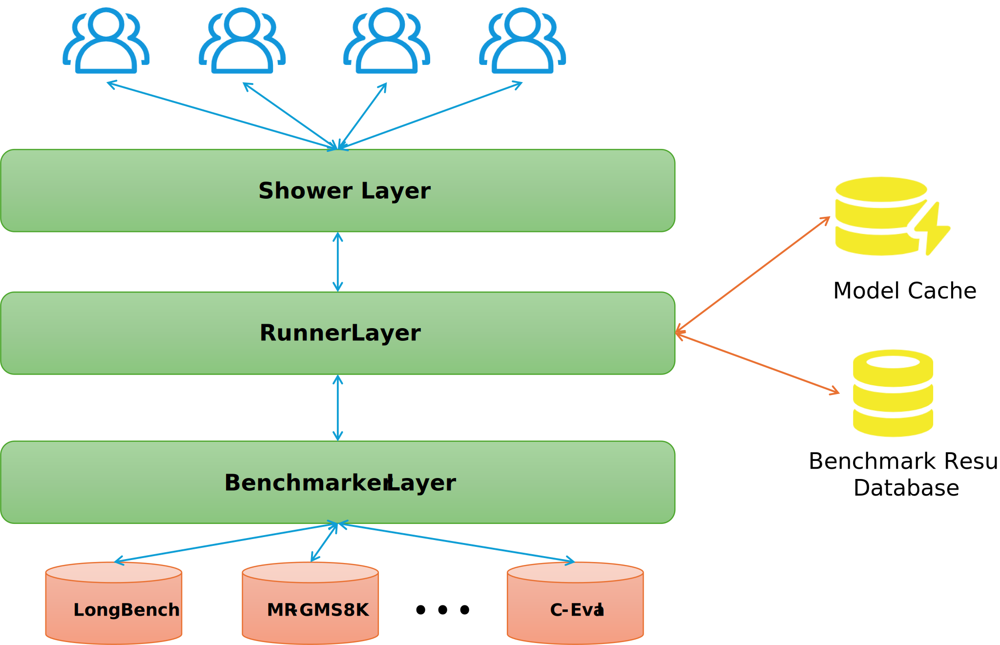

## LLM Bench Shower

> 天津大学 2025年秋 《自然语言处理》小组课设

一个支持对本地和云端LLMs做benchmark并可视化展示的系统

### 整体架构

### 效果展示

TBA

### Benchmark 数据集

- LongBench
    - 长文本
    - ACL'24
    - [https://github.com/THUDM/LongBench](https://github.com/THUDM/LongBench)
- LongBenchV2
    - 长文本
    - ACL'25
    - [https://github.com/THUDM/LongBench](https://github.com/THUDM/LongBench)
- MR-GMS8K
    - 推理能力
    - ICLR'25
    - [https://github.com/dvlab-research/MR-GSM8K](https://github.com/dvlab-research/MR-GSM8K)
- C-Eval
    - 中文多学科专业知识
    - NIPS'23
    - [https://github.com/hkust-nlp/ceval](https://github.com/hkust-nlp/ceval)
- CMMMU
    - 中文多学科通识型知识
    - CORR'24
    - [https://github.com/CMMMU-Benchmark/CMMMU](https://github.com/CMMMU-Benchmark/CMMMU)
- LLMTest_NeedleInAHaystack
    - 长上下文信息检索
    - ICLR'24
    - [https://github.com/gkamradt/LLMTest_NeedleInAHaystack](https://github.com/gkamradt/LLMTest_NeedleInAHaystack)

### Quick Start

TBA
